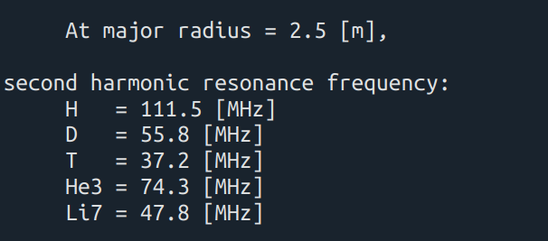
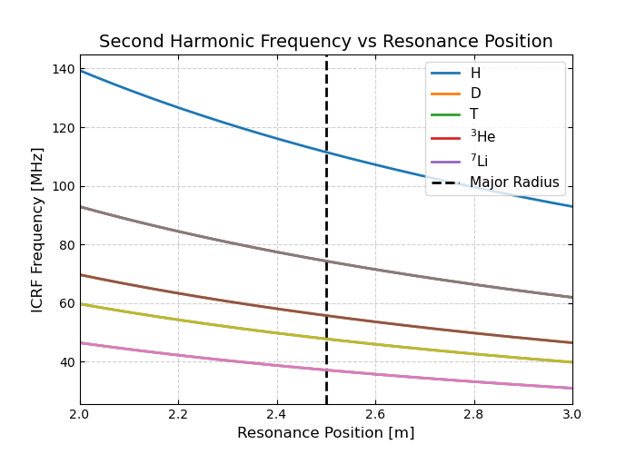
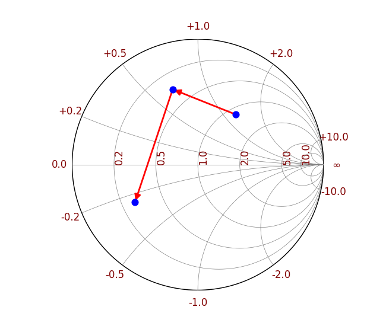
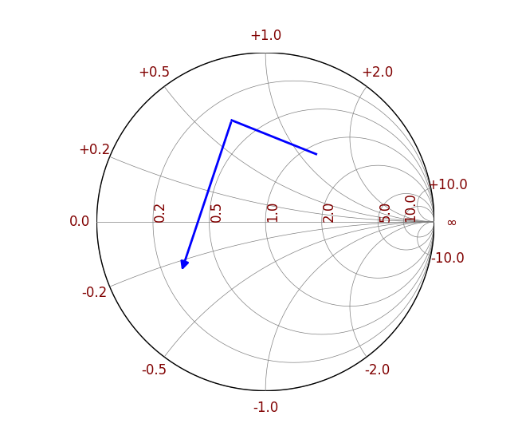
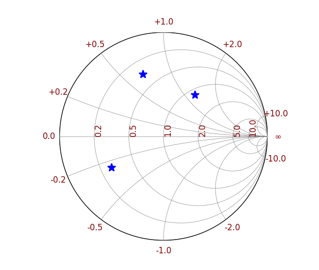

# ICRF-TOOLS
Several simple code for ICRF

# Table of Contents
- [Module overview](#module-overview)
- [1. ICRF_parameters.py](#sec-icrf_parameters)
- [2. Res_Freq.py](#sec-res_freq)
- [3. Load.py](#sec-load)
- [4. smith_chart.py](#sec-smith_chart)

<a id="module-overview"></a>
# Module overview

| Module | Purpose | Key API |
|---|---|---|
| ICRF_parameters.py | Provide physical constants for all tools | constants |
| Res_Freq.py | Resonance frequency vs radius; plots + values | compute f(R), plot |
| Load.py | Read Touchstone, build complex S-matrices | fun_load_touchstone(path) |
| smith_chart.py | Plot Smith chart and S loci | smith_Smatrix(S, num, display_mode) |


<a id="sec-icrf_parameters"></a>
# ICRF_parameters.py
This file contains several important constants that are widely used in the code. Please download it before using other codes. It contains:  
```python
c  = 299792458          #Light speed [m/s]  
e0 = 8.854187817e-12    #Vacuum Permittivity [F/m]  
u0 = 4*np.pi*1e-7     #Permeability of vacuum [H/m]  
q0 = 1.60217733e-19;    #Elementary positive charge [C]  
m0 = 1.6726231e-27;     #Atomic mass unit [kg]  
```
## Usage
```python
from ICRF_parameters import c, e0, u0,q0, m0
```

<a id="sec-res_freq"></a>
# Res_Freq.py
This tool calculates the ICRF resonance frequency as a function of the plasma’s radial position, providing both graphical outputs and precise frequency values at the Rajor radius and magnetic axis. Based on following equations:

$$
B(R) = \frac{B_0*R_0}{R}
$$

$$
\omega_i = 2\pi f = \frac{Zq*B}{Am_p}
$$

Therefore:

$$
f = \frac{1}{2\pi}\frac{Zq*B_0R_0}{A\,m_p}\frac{1}{R}
$$

By input the parameters major radius (position of axis), minor radius, magnetic field and harmonic number. One can get following results:
<p align="center">

</p>
<p align="center">

</p>

<a id="sec-load"></a>
# Load.py 
By using fun_load_touchstone, one can converts `.sNp` files into complex S-matrices per frequency point.
It will return:
- `f`: 1D frequency array in `Hz`
- `S`: list of complex S-matrices of shape `(nports, nports)`, one per frequency

**Core reconstruction (magnitude + angle → complex):**

$$
S_{ij} = |S_{ij}|\, e^{j\theta_{ij}},\quad \theta_{ij}\ \text{in degrees}
$$

**Minimal usage:**

    import numpy as np
    from fun_load_touchstone import fun_load_touchstone

    f, S = fun_load_touchstone("input/example/smatrix_aug-like.s4p")  # f in Hz
    S11 = np.array([Sm[0,0] for Sm in S])  # complex S11 over frequency

**Note:** expects `S MA` (magnitude, angle in degrees). For `S DB` or `S RI`, extend the parsing and convert accordingly.

<a id="sec-smith_chart"></a>
# smith_chart.py

This program draws a Smith chart on the complex plane and places one or more S-parameters (complex reflection coefficient $\Gamma$) at their corresponding locations. It supports 1) points, 2) polylines, and 3) arrows to show how the locus evolves with frequency.

The chart is drawn in the $\Gamma$-plane (reflection-coefficient plane). Starting from the normalized impedance $z = Z/Z_0$, the relationship with the reflection coefficient is

$$
\Gamma = \frac{z-1}{z+1}, \qquad
z = \frac{1+\Gamma}{1-\Gamma}.
$$

For S-parameters given by magnitude and phase, the complex form is

$$
S = |S|\,e^{j\theta},
$$

where $\theta$ may be in radians or degrees. If your Touchstone reader returns degrees, convert to radians before using trigonometric functions; this program expects complex $S$ directly.

The resistance and reactance families on the Smith chart satisfy the following geometry.

- **Constant resistance** $r=\text{const}$: center and radius in the $\Gamma$-plane

$$
x_c=\frac{r}{1+r}, \qquad R=\frac{1}{1+r},
$$
  
  with circle equation $(x-x_c)^2+y^2=R^2$.

- **Constant reactance** $x=\text{const}$: center and radius

$$
x_c=1,\qquad y_c=\frac{1}{x},\qquad R=\frac{1}{|x|},
$$
  
  with circle equation $(x-1)^2+(y-y_c)^2=R^2$.

The program draws these resistance and reactance families and clips them to the unit circle.

## Code structure and core interface ##

Core function (Python):

    smith_Smatrix(S, num=1, display_mode='points_and_arrows')

Parameters:
- **S**: complex array (single point or 1-D array).
- **num**: figure window index.
- **display_mode**: 'points_and_arrows', 'line_with_arrow', or 'points_only'.

The function returns a matplotlib.figure.Figure with a white background; axes are hidden and the aspect ratio is equal.

## Quick start ##

Clone or copy the repo locally, ensure load/fun_load_touchstone.py is available, and prepare your Touchstone file (e.g., input/example/smatrix_aug-like.s4p).

Example 1: demonstrate the three display modes

```python
import numpy as np
import matplotlib.pyplot as plt
from smith_chart import smith_Smatrix  # rename if your file differs

S = np.array([0.3 + 0.4j, -0.2 + 0.6j, -0.5 - 0.3j])

smith_Smatrix(S, 1, display_mode='points_and_arrows')
smith_Smatrix(S, 2, display_mode='line_with_arrow')
smith_Smatrix(S, 3, display_mode='points_only')
plt.show()
```


<p align="center"><b>Smith chart display modes</b></p>
<div align="center">
  <table width="100%">
    <tr>
      <td align="center" width="33%">
        <br>
        <sub>(a) Points + arrows</sub>
      </td>
      <td align="center" width="33%">
        <br>
        <sub>(b) Line with end arrow</sub>
      </td>
      <td align="center" width="33%">
        <br>
        <sub>(c) Points only</sub>
      </td>
    </tr>
  </table>
</div>

Example 2: read `S11(f)` from `.s4p` and plot a “polyline + end arrow” locus

```python
import numpy as np
import matplotlib.pyplot as plt
from load import fun_load_touchstone as flt
from smith_chart import smith_Smatrix

pre = 'input/example/'
fname = 'smatrix_aug-like.s4p'
fre, S = flt(pre + fname)        # fre: frequency array; S: S-matrix at each freq
S11 = np.array([Sm[0, 0] for Sm in S])

fig = smith_Smatrix(S11, 1, display_mode='line_with_arrow')
fig.savefig('smith_S11_track.png', dpi=300, bbox_inches='tight')
plt.show()
```
If your Touchstone frequency unit is not hertz (e.g., MHz), convert fre as needed. The Smith plot uses only the complex S-parameter, so the frequency unit does not affect the plot itself, but labeling figures with correct units improves readability.

## Tips
- Smith charts are most commonly used for reflection/impedance analysis; use `S11` or `S22` as inputs.
- If your data are given as magnitude and phase in degrees, convert to complex first; if your reader returns complex values already, pass them directly.
- The chart confines resistance/reactance families to the unit circle and adds compact annotations for typical resistance/reactance values.
